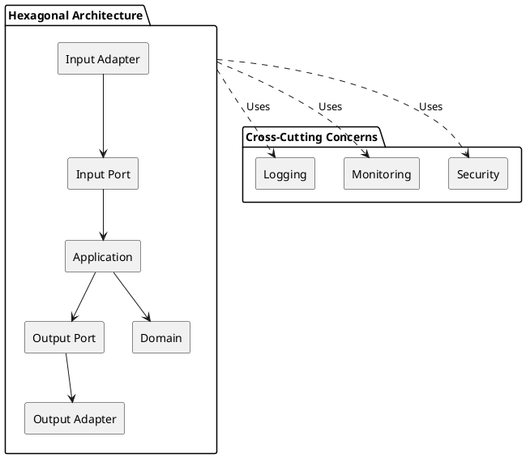

# Hexagonal Architecture

> This proof of concept (PoC) demonstrates the implementation of Hexagonal Architecture (also known as the Ports and Adapters Architecture) to achieve a clean, maintainable, and testable software design.
> The approach emphasizes isolating the core business logic from external systems, ensuring that the application remains flexible, adaptable, and testable, regardless of changes in technology or infrastructure.

# Table of Contents
- [What is Hexagonal Architecture](#what-is-hexagonal-architecture)
  - [Package Structure](#package-structure)
  - [Core Concepts](#core-concepts)
- [General Overview](#general-overview)
  - [Overall](#overall)
  - [External Frameworks and Tools](#external-frameworks-and-tools)
  - [Dependencies](#dependencies)
- [Getting Started](#getting-started)
  - [Containerized Frameworks](#containerized-frameworks)
  - [Installation](#installation)
  - [Run](#run)
- [Google Pub/Sub](#google-pubsub)
  - [Verify Emulator is Running](#verify-emulator-is-running)
  - [Publish Messages](#publish-messages)
- [Testing](#testing)
  - [Unit Tests](#unit-tests)
  - [Integration Tests](#integration-tests)
- [Future Improvements](#future-improvements)


## What is Hexagonal Architecture
Hexagonal Architecture is a design pattern introduced by Alistair Cockburn to create applications that are independent 
of frameworks, user interfaces, databases, or external services. The architecture revolves around decoupling the core business 
logic (the Domain) from external concerns by using Ports and Adapters.

### Package Structure
```
src
└── main
    └── kotlin
        └── hexagonalarchitecture
            ├── adapter
            │   ├── inbound
            │   └── outbound
            │
            ├── application
            │   ├── domain
            │   ├── dto
            │   ├── service
            │   └── port
            │       ├── inbound
            │       └── outbound
            │
            └── crosscutting
```

### Core Concepts
- **Domain Layer:** Represents the core entities of the application and includes state machine logic for specific fields 
of those entities. It is framework-independent and focuses solely on domain-specific behavior;
- **Application Layer:** Implements workflows and use cases by coordinating the domain layer. It acts as a bridge between 
the domain and the external world, applying domain behavior to real-world operations;
- **Ports Layer:** Defines the interfaces for communication with external systems. Input ports handle incoming interactions 
(e.g., API requests), while output ports define how the application connects to external dependencies like databases or message queues;
- **Adapters Layer:** Implements the ports to connect the application to specific technologies or external systems. 
Input adapters manage incoming requests (e.g., REST controllers), and output adapters handle outgoing interactions (e.g., repositories, APIs);
- **Cross-Cutting:** A concept introduced to manage shared concerns such as logging, monitoring, and security. This 
ensures these aspects are centralized and reusable, without cluttering other layers.

### Layer Dependencies Diagram


## General Overview

### Overall
- Developed in **Kotlin** for its concise and expressive syntax;
- Built on the **Spring Framework**, leveraging its ecosystem for dependency injection, configuration management, and integration support.
- Implements the **Hexagonal Architecture** to promote clean separation of concerns and maintainable design.

### External Frameworks and Tools
- **Databases:**
  - **H2:** An embedded in-memory database for lightweight testing.
  - **TODO:** ~~**MySQL:** A production-ready relational database for persistent storage.~~
- **Message Brokers:**
  - **Pub/Sub:** Google Cloud Pub/Sub emulator for message-driven communication.
  - **TODO:** ~~Kafka, RabbitMQ, and Redis to explore alternative message-driven solutions.~~

### Dependencies
This project uses a variety of dependencies, grouped by purpose:
- **Core Framework**
  - **Spring Boot Starter Web:** For building web applications and RESTful APIs;
  - **Spring Boot Starter Data JPA:** Simplifies database interactions using JPA and Hibernate.
- **Kotlin Support**
  - **Jackson Module Kotlin:** For seamless JSON serialization and deserialization in Kotlin;
  - **Kotlin Reflect:** Enables reflection capabilities in Kotlin;
  - **Kotlin Stdlib:** The standard library for Kotlin.
- **Database**
  - **H2 Database:** An in-memory database for lightweight testing;
  - ~~**MySQL:** A relational database for production use;~~
  - **Flyway Core:** Manages database migrations and version control.
- **Messaging**
  - **Spring Cloud GCP Starter PubSub:** Integration with Google Cloud Pub/Sub for messaging;
  - **Avro:** A schema-based serialization system for defining and exchanging structured data.
- **Dependency Injection and Mapping**
  - **Lombok:** Reduces boilerplate code for getters, setters, and constructors;
  - **MapStruct:** A Java annotation processor for generating type-safe bean mappers.
- ~~**Redis**~~
  - ~~**Spring Data Redis:** Abstraction for Redis operations;~~
  - ~~**Spring Boot Starter Data Redis:** Redis integration support for Spring Boot.~~
- **Testing**
  - **Spring Boot Starter Test:** Provides testing utilities for Spring applications;
  - **Mockk:** A mocking library tailored for Kotlin;
  - **Kotlin Fixture:** Generates random test data for Kotlin objects;
  - **Awaitility Kotlin:** Fluent API for testing asynchronous operations.

  

## Getting Started

### Containerized Frameworks
```bash
$ docker-compose up
```

### Installation

```bash
$ mvn clean install
```

### Run

```bash
$ mvn spring-boot:run
```


## Google Pub/Sub
Google Cloud Pub/Sub is a messaging service that enables asynchronous communication between applications. It decouples 
message producers and consumers, ensuring reliable delivery and scalability for event-driven systems.

For detailed documentation on working with Google Pub/Sub, refer to [this tutorial](https://simonscholz.dev/tutorials/spring-quarkus-google-pubsub).

### Verify Emulator is Running
To ensure the Pub/Sub emulator is running, you can list all topics and subscriptions with the following commands:
- List all topics
```bash
$ curl -X GET 'http://0.0.0.0:8685/v1/projects/hexagonal-architecture/topics'
```
- List all subscriptions
```bash
$ curl -X GET 'http://0.0.0.0:8685/v1/projects/hexagonal-architecture/subscriptions'
```

### Publish Messages
To publish a message to a topic, use the following curl command:
```bash
curl -X POST "http://0.0.0.0:8685/v1/projects/hexagonal-architecture/topics/json-topic:publish" \
-H "Content-Type: application/json" \
-d '{
  "messages": [
    {
      "attributes": {
        "messageId": "0d6dbb28-9687-4033-9263-52a361b4d268",
        "eventEntity": "PERSON",
        "eventOperation": "CREATE"
      },
      "data": "ewogICJwZXJzb25JZCI6ICIzNzczMmU4Yy1hZjY3LTRmZjktYTI4My0zY2ViNTVmY2Q0ZjIiLAogICJuYW1lIjogIlZhc2NvIEx1c2l0YW5vIiwKICAiYWdlIjogMjcsCiAgInNleCI6ICJNQVNDVUxJTkUiLAogICJtYXR1cml0eSI6ICJBRFVMVCIKfQ=="
    }
  ]
}'
```

**Note:**
The data field (payload) contains a Base64-encoded JSON object. To encode JSON into Base64, you can use the following command:
```bash
$ echo -n '{"personId":"12345","name":"Vasco Lusitano","age":27,"sex":"MASCULINE","maturity":"ADULT"}' | base64
```
This ensures the JSON object is properly formatted for inclusion in the payload.


# Testing
This project employs a structured testing approach to ensure the reliability and correctness of the application. The 
tests are organized into two main categories: Unit Tests and Integration Tests.

## Unit Tests
Unit tests focus on isolated components of the application, ensuring that individual classes or methods behave as 
expected. These tests:
- Mock dependencies to verify the logic of a specific component in isolation;
- Cover core functionalities, edge cases, and error handling;
- Run quickly and provide immediate feedback during development.

## Integration Tests
Integration tests validate the behavior of the application across multiple layers, simulating real-world scenarios. These 
tests:
- Cover end-to-end use cases, involving multiple components like adapters, ports, and services;
- Ensure that the application integrates correctly with external systems like databases or messaging systems;
- Use emulator frameworks like databases and messaging services to replicate production-like behavior.


# Future Improvements
- Add support for RabbitMQ and Kafka messaging systems;
- Introduce gRPC and GraphQL as new input adapters;
- Use Spring State Machine for domain entity state validation;
- Refactor the REST endpoint to align better with use case logic;
- Add a MySQL container with a Maven profile for database testing;
- Improve Redis integration for advanced use cases;
- Add architecture tests for example with Konsist;
- Add more publish cases for Google Pub/Sub.
